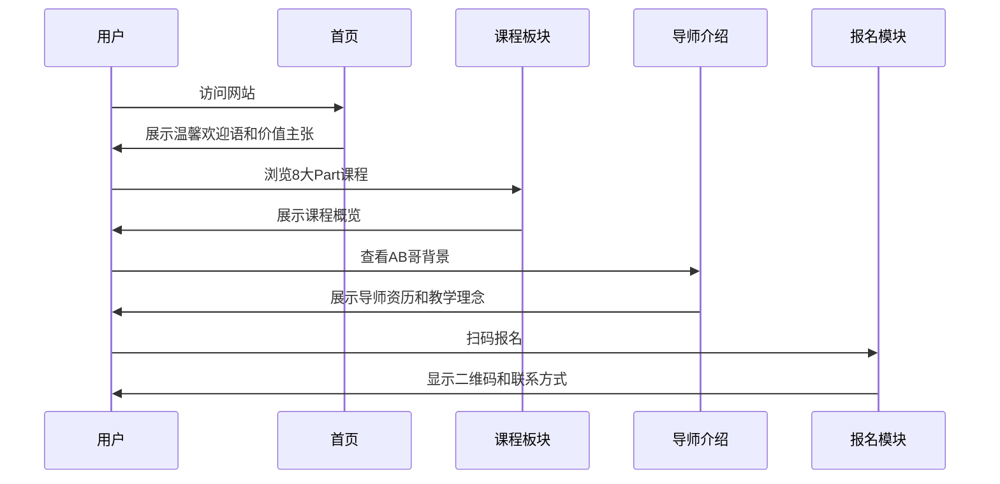

# AI学习社团产品需求文档 (PRD)

## 📋 产品路线图 (Product Roadmap)

### 核心目标 (Mission)
让零基础学员通过AI学习社团轻松掌握AI技能，紧跟技术时代步伐。

### 用户画像 (Persona)
- **姓名**：张小明（28岁）
- **背景**：非技术专业，对AI技术有浓厚兴趣但不知从何入手
- **痛点**：担心技术发展太快被淘汰，市面上AI课程太复杂难以入门
- **目标**：想系统学习AI知识，找到志同道合的学习伙伴

---

## V1: 最小可行产品 (MVP)

### 核心功能清单：
1. **首页英雄区块** - 突出"跟上时代不掉队"的核心价值主张
2. **课程介绍板块** - 8大Part系统课程概览
3. **导师介绍** - AB哥个人品牌展示
4. **学习成果展示** - 社群学习氛围和黑客松活动
5. **价格与报名** - 清晰的价格展示和微信二维码
6. **响应式设计** - 适配PC和移动端

---

## V2 及以后版本 (Future Releases)

### 规划功能：
1. **学员案例分享** - 往期学员的学习心得和成果
2. **详细课程大纲** - 每个Part的具体学习内容
3. **免费试听内容** - 1-2节免费体验课程
4. **常见问题FAQ** - 解答学员常见疑问
5. **学习社区入口** - 微信群或Discord社区链接

---

## 关键业务逻辑 (Business Rules)

### 定价策略
- **标准价格**：299元/季度
- **报名流程**：扫码加微信 → 咨询详情 → 支付费用 → 加入学习群
- **服务承诺**：AB哥亲自答疑、参与黑客松、社群互助

### 服务内容
- 8大Part系统课程
- AB哥亲自指导答疑
- 参与黑客松比赛
- 社群互助氛围
- 手把手教做产品

---

## 数据契约 (Data Contract)

### 静态数据
- 课程信息：8大Part课程概览
- 导师介绍：AB哥个人背景和资历
- 价格信息：课程费用和支付方式
- 联系方式：微信二维码和客服信息

### 媒体资源
- 个人照片：AB哥证件照、工作照
- 二维码：微信收款码
- 课程相关图片：学习场景、学员活动照片

### 外部链接
- 微信联系方式
- 可能的社交媒体链接

---

## MVP原型设计：方案1 - 温馨社区式

```
┌─────────────────────────────────────────────────────┐
│  ☰ [AI学习社团 logo]                📱 微信联系      │
├─────────────────────────────────────────────────────┤
│                                                     │
│    🌟 不想被AI时代淘汰？我们陪您一起成长！            │
│                                                     │
│    💪 专为零基础设计 | 👨‍🏫 AB哥亲自带班           │
│    🎯 8大系统课程 | 🏆 参与实战黑客松              │
│                                                     │
│    [立即报名 299元] [免费咨询]                       │
│                                                     │
│  ─────────────────────────────────────────────────── │
│                                                     │
│  📚 课程体系 (8大Part)                               │
│  ┌─────┬─────┬─────┬─────┐                         │
│  │ Part1│ Part2│ Part3│ Part4│  [详细课程介绍]     │
│  │ AI入门│ 提示词│ 实战1│ 实战2│                    │
│  └─────┴─────┴─────┴─────┘                         │
│                                                     │
│  ┌─────────────────────────────────┐  ┌─────────────┐ │
│  │                                 │  │             │ │
│  │      👨‍🏫 导师介绍                │  │  📱 扫码    │ │
│  │                                 │  │             │ │
│  │      AB哥 - AI实战专家          │  │  立即加入    │ │
│  │                                 │  │             │ │
│  └─────────────────────────────────┘  └─────────────┘ │
│                                                     │
│  💬 学员评价: "零基础也能学得很扎实！"                │
│                                                     │
└─────────────────────────────────────────────────────┘
```

### 设计特点
- **温馨氛围**：使用暖色调，营造亲和力
- **社区感**：强调学习和陪伴，而非冷冰冰的教育
- **信任建立**：突出导师个人品牌和学员评价
- **行动导向**：清晰的报名入口和价格展示

---

## 架构设计蓝图

### 核心流程图



### 组件交互说明

#### 现有代码复用情况

**✅ 可直接使用的组件：**
- `header.tsx` - 需要修改菜单项为"首页"、"课程体系"、"导师介绍"、"立即报名"
- `hero-section.tsx` - 需要更新文案为温馨社区式风格
- `calltoaction.tsx` - 基本符合需求，微调即可
- `features.tsx` - 可改造为课程体系展示
- `footer.tsx` - 直接使用
- `stats.tsx` - 可改造为学员成果展示

#### 需要新增的组件

**新增组件列表：**
- `WarmWelcomeSection.tsx` - 温馨欢迎区块
- `CourseGrid.tsx` - 8大Part课程网格布局
- `TeacherProfile.tsx` - AB哥个人介绍卡片
- `CommunityShowcase.tsx` - 社群氛围展示
- `TestimonialSection.tsx` - 学员评价区块

#### 组件层级关系

```
App.tsx
├── HeroHeader (修改现有)
├── WarmWelcomeSection (新增)
├── HeroSection (修改现有)
├── CourseGrid (新增，基于features.tsx改造)
├── TeacherProfile (新增)
├── TestimonialSection (新增，基于stats.tsx改造)
├── CommunityShowcase (新增)
├── CTASection (微调现有)
└── Footer (使用现有)
```

### 技术选型与风险

#### 技术栈
- **框架**: Next.js 14 (已有模板)
- **样式**: Tailwind CSS (已有配置)
- **UI组件**: shadcn/ui (已有集成)
- **图标**: Lucide React (已在使用)

#### 设计系统
- **主色调**: 暖色系 (#FF6B35, #F7931E, #FFC947)
- **辅助色**: 温暖的灰调 (#F7F7F7, #E8E8E8)
- **字体**: 系统默认字体栈，确保可读性
- **圆角**: 较大的圆角值 (16px, 24px) 营造亲和感

#### 潜在技术风险

1. **图片优化**: 需要压缩现有图片资源，避免加载过慢
2. **响应式适配**: 温馨设计在移动端的展示需要特别关注
3. **颜色对比度**: 暖色调需确保文字可读性
4. **SEO优化**: 静态网站需要合理的meta标签和结构化数据

#### 部署建议

- **托管**: Vercel (与Next.js完美集成)
- **CDN**: 自动图片优化和全球分发
- **域名**: 简洁易记的域名
- **Analytics**: 简单的访问统计

---

## 下一步行动计划

### 开发优先级

1. **第一阶段**：修改现有组件，更新为温馨社区式设计
2. **第二阶段**：开发新增组件，完善功能区块
3. **第三阶段**：整体调试和优化，确保响应式效果
4. **第四阶段**：SEO优化和性能调优
5. **第五阶段**：部署上线和监控

### 成功指标

- **页面加载速度**：首屏加载时间 < 3秒
- **用户体验**：移动端适配评分 > 90分
- **转化率**：访客到咨询转化率 > 5%
- **可访问性**：通过基础无障碍测试

---

## 📝 文档版本信息

- **创建日期**: 2025-12-17
- **版本**: v1.0 MVP
- **创建人**: Claude AI首席产品设计师
- **状态**: 已确认，等待开发

---

*本PRD文档将作为AI学习社团网站开发的指导文档，所有产品和技术决策应基于此文档执行。*